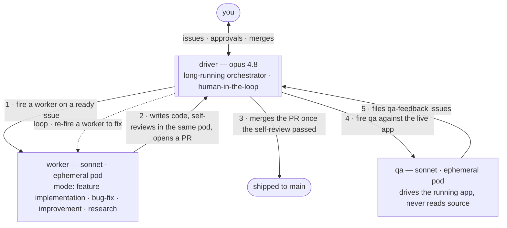

# hive

A one-shot coding-agent fleet. You point `hivectl` at a GitHub issue, and it
runs Claude Code in a throwaway Kubernetes pod that opens a pull request. It's
**per-project**: you run `hivectl` inside an app repo and everything it creates
(pods, secrets, logs) is scoped to that project, so one cluster can host fleets
for many repos at once.

The tracker is **GitHub Issues in the same repo as the code** — no separate
ticket system. Each issue carries a `## Definition of Done` checklist and a
`## Plan`; the fleet treats those as the authoritative success criteria.

## How it works

Three roles, two of them ephemeral pods, all driven by one loop:



- **driver** — a long-running Claude Code session on your machine (Opus 4.8),
  with you in the loop. It plans issues, fires workers and qa, reads the
  verdicts, merges the PRs, and course-corrects. It never writes app code.
- **worker** — an ephemeral pod (Sonnet) that does the actual work in one of
  four modes. It writes the code, **self-reviews inside the same pod** against
  the Definition of Done (a fresh-context grade that returns `PASS` or
  `CHANGES_REQUESTED`), and opens the PR. On `PASS` the driver merges; on
  `CHANGES_REQUESTED` the driver re-fires a worker. The pod exits when done.
- **qa** — an ephemeral pod (Sonnet) that drives the **running app** from the
  outside. It never clones or reads the source; it files `type:qa-feedback`
  issues, which feed straight back into the loop as new work.

### Worker modes

`hivectl fire <ISSUE> --type=<T>` picks the worker's mode:

| `--type` | What it does |
|---|---|
| `feature-implementation` | Build a new capability from the issue's Plan + DoD. |
| `bug-fix` | Reproduce, fix the root cause, prove it with the DoD checklist. |
| `improvement` | Refactor / harden / tidy without changing behavior. |
| `research` | Produce a findings document — no code. |

The target repo owns the per-type playbooks (`<app>/.claude/skills/<TYPE>/`)
and per-repo rules (`<app>/.claude/CLAUDE.md`); the pod auto-loads them.

## Requirements

Host CLIs (run `hivectl doctor` to check): `kubectl`, `docker`, `jq`, `yq`,
`gh`, `envsubst` (gettext), `claude` (Claude Code). For the local cluster on
macOS: `minikube` + `vfkit`.

## Install

```bash
npm i -g @anupam/hive   # installs the `hivectl` command
```

## Quickstart

```bash
# one-time, per machine
hivectl bootstrap                 # doctor → local-cluster-up → setup

# one-time, per project
cd ~/my-app
hivectl init                      # scaffold .hive/config.yaml
hivectl labels sync               # push status:*/type:* labels into the repo
hivectl agent-setup               # build the pod image + create the creds secret

# fire the fleet
hivectl fire 42 --type=feature-implementation
hivectl tail 42                   # live-tail the pod
hivectl merge 42                  # merge issue #42's reviewed PR
hivectl qa --url=http://web.my-app.svc.cluster.local:3000 --target=42

# orchestrate hands-off
hivectl driver                    # opens the driver session in this repo
```

## Command reference

Run `hivectl help` for the full list. The essentials:

| Command | What |
|---|---|
| `fire <ISSUE> --type=<T>` | Fire a worker against a GitHub issue. |
| `qa --url=<U> [--target=<ISSUE>]` | Fire a qa agent against a deployed URL. |
| `merge <ISSUE>` | Merge the issue's reviewed PR (refuses unless `status:in-review`). |
| `status <ISSUE> <STATUS>` | Set the issue's `status:*` label (enforces the mutex). |
| `driver` | Open the local driver (orchestrator) session. |
| `tail` / `logs` / `metrics` / `ui` | Watch pods, list runs, cost table, analytics UI. |
| `expose` | Port-forward prometheus + headlamp + the app and start the UI (one process). |
| `init` / `config` / `labels` / `gc` | Per-project setup + housekeeping. |
| `bootstrap` / `doctor` / `setup` / `agent-setup` | One-time infra setup. |
| `local-cluster-up` / `local-cluster-down` | Local cluster lifecycle (macOS). |
| `version` / `root` / `help` | Misc. |

## Architecture

The deep design — labels, the Definition-of-Done gate, the in-pod review
contract, the per-fire spend caps, the cluster layout — lives in
[`.claude/CLAUDE.md`](.claude/CLAUDE.md), with a browsable version under
[`docs/`](docs/index.html).
